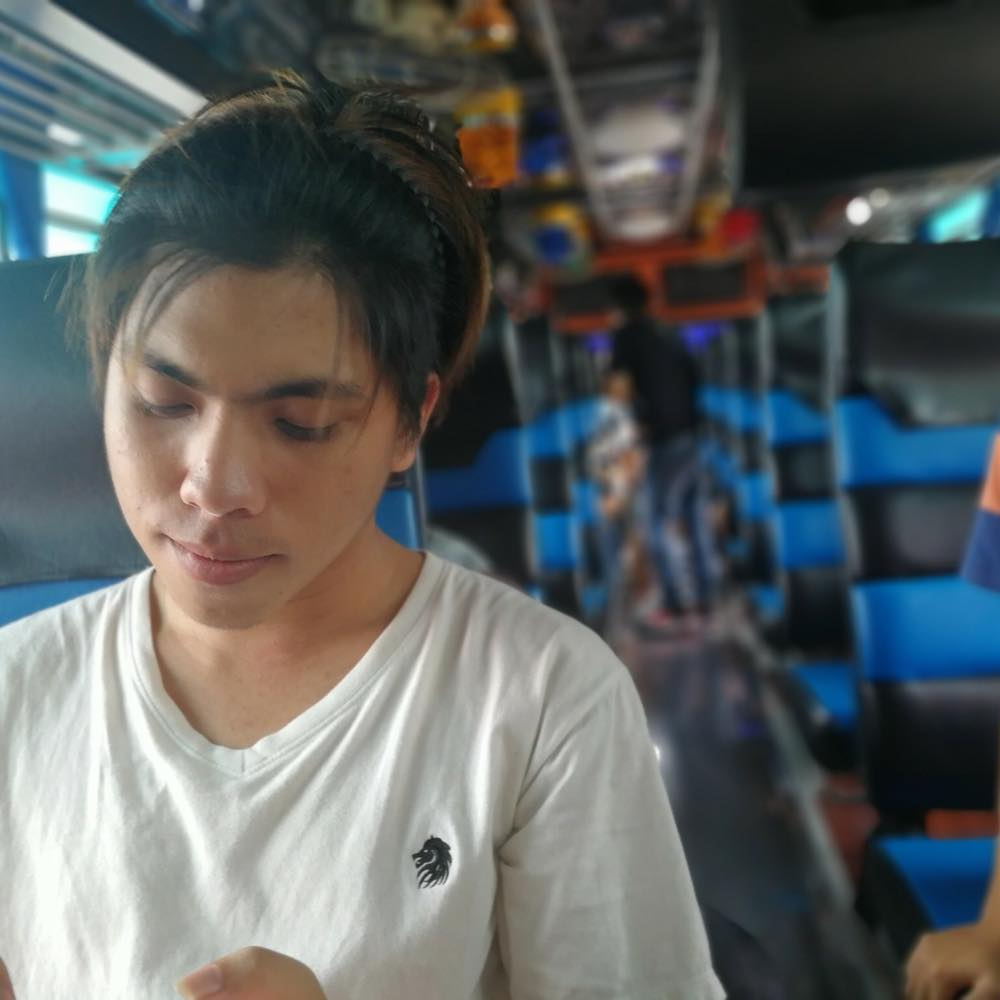

# Pre-Programming 2018 Solutions
This repository contains solutions of all problems in the preparatory course *(known as Pre-Programming 2018)*, both online and onsite period.

This repository was made to be a guidance for all students who participated in this preparatory course.

Course information can be viewed [here](https://github.com/itforge-eros/PreProgramming2018-Docs).

## Usage
As mentioned above, this repository should be used as a guidance, a hint or to learn new solutions, which means this should not be used for copying.

## Instructions
As you can see up to 4 folders, each folder includes solution files for all problems in the specific problem catagory. All files are in Python format.

There are a total of 4 problem catagories, which includes:

- Online
- Onsite
- Quiz
- Extra

## Problems Credits
|||||
|:---:|:---:|:---:|:---:|
|[wiput1999](https://github.com/wiput1999)|[810Teams](https://github.com/810Teams)|[CAT6e](https://github.com/CAT6e)|[wannovo](https://github.com/wannowo)|
|Wiput Pootong|Teerapat Kraisrisirikul|Sakorn Saokaew|Taitana Yumee|
|||||
|[POKINBKK](https://github.com/POKINBKK)|[CokeFung](https://github.com/CokeFung/)|[RawitSHIE](https://github.com/RawitSHIE)|[jusmistic](https://github.com/jusmistic)|
|Supakit Theanthunyakit|Fungkiat Phadejtaku|Rawit Lohakhachornphan|Puttimate Thammasang|
|||||
|[nutorbit](https://github.com/nutorbit)|[fpiyapol](https://github.com/fpiyapol)|[TheNlesh](https://github.com/TheNlesh)|[158Alfetta](https://github.com/158Alfetta)|
|Nut Chukampang|Piyapol Poempongpaiboon|Pitchayapol Petchboonchuay|Udomeak Puwathanachaipisan|
|||||
|[prapawity](https://github.com/prapawity)|[NaponTunglukmongkol](https://github.com/NaponTunglukmongkol)|[spyasdza](https://github.com/spyasdza)|[Phongsathron](https://github.com/Phongsathron)|
|Prapawit Pattasiriwichot|Napon Tunglukmongkol|Pitchayut Deachnu|Phongsathron Kittiworapanya|

